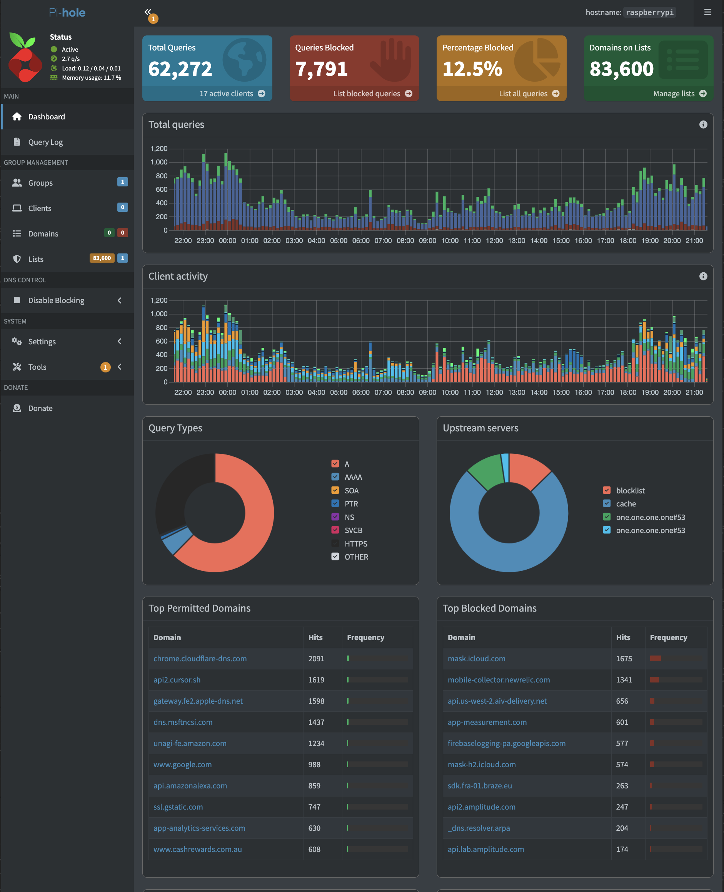

# Home Network Monitoring with Pi-hole

A practical home network monitoring setup using a Raspberry Pi 3 running Pi-hole, behind a Starlink connection, with a TP-Link Archer AX1800 as the secondary router.

## Architecture

```
Internet (Starlink)
        │
 Starlink Router  ← no admin access, Wi-Fi disabled
        │ (ethernet)
 TP-Link Archer AX1800  ← all devices connect here, DHCP DNS → Pi-hole
        │ (ethernet)
 Raspberry Pi 3 (192.168.0.200)  ← Pi-hole DNS server
```

## Hardware

| Device | Purpose |
|---|---|
| Raspberry Pi 3 | Runs Pi-hole DNS server |
| TP-Link Archer AX1800 | Secondary router, DNS pointed to Pi-hole |
| Starlink Router | Internet source (no admin access) |

## Documentation

- [Hardware List](docs/hardware-list.md)
- [Setup Guide](docs/setup-guide.md)
- [Troubleshooting](docs/troubleshooting.md)

## Why This Setup?

Starlink routers are closed systems with no admin panel access. This setup works around that limitation by adding a secondary router (AX1800) where DNS can be configured to point to Pi-hole running on the Raspberry Pi. Every device on the network then has its DNS queries logged and filtered by Pi-hole.

## Skills Learned

- DNS and DHCP fundamentals
- Network segmentation behind a closed ISP router (double NAT)
- Device fingerprinting via MAC addresses
- Real-time traffic and DNS query monitoring
- Linux administration on Raspberry Pi (headless SSH setup)

## Author

Don — Melbourne, Australia
